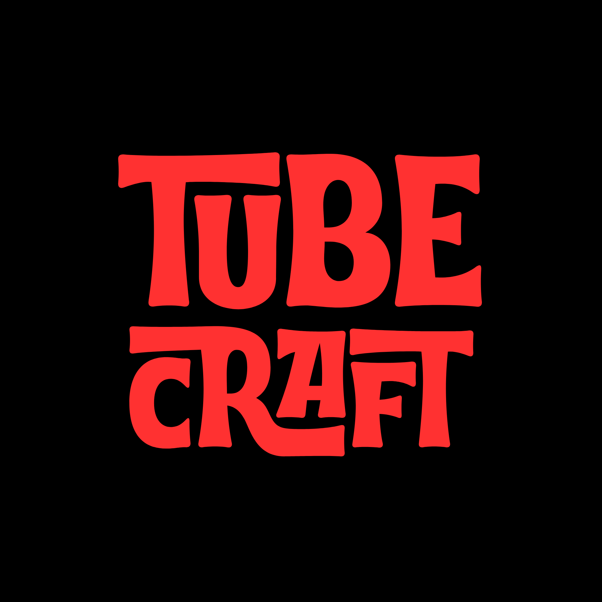

  
  
  <h1 style="font-size: 3em; font-weight: 900; letter-spacing: 2px;">🚀 TubeCraft for YouTube 🚀</h1>
  
  

    <b style="color: #ff4757;">The Ultimate Next-Generation YouTube Player Experience!</b> 
    <i style="color: #747d8c;">YouTube oynatıcısını bambaşka bir boyuta taşıyan, yeni nesil ve kusursuz deneyim!</i>
  

  

    <a href="#english"><b>🇬🇧 English Version</b></a> &nbsp;•&nbsp; <a href="#turkish"><b>🇹🇷 Türkçe Sürüm</b></a>
  

  
   

  > [!CAUTION]
  > <h2 style="color: #ff4757; margin: 0;">🚧 BETA VERSION WARNING | BETA SÜRÜM UYARISI 🚧</h2>
  > 
  > **ENG:** This project is currently in **<ins>Active Beta</ins>**. You may encounter **unexpected bugs**, some features might not work as intended or might be missing entirely, and certain **UI elements might break or shift unexpectedly** depending on YouTube's updates. **Some parts in the code might not work at all.** Use at your own risk and expect regular updates!
  >
  > **TR:** Bu proje şu anda **<ins>Aktif Beta</ins>** aşamasındadır. **Beklenmedik hatalarla** karşılaşabilirsiniz, bazı özellikler tam olarak çalışmayabilir/olmayabilir ve YouTube'un arka planda yaptığı güncellemelere bağlı olarak **arayüzde (UI) kaymalar veya bozulmalar** meydana gelebilir. **Kodlarda bazı yerler çalışmayabilir.** Kullanırken bunu göz önünde bulundurun, eklenti test aşamasındadır ve güncellemeler gelmeye devam edecektir!

# 🇬🇧 English Documentation

> [!WARNING]  
> <h3 style="margin: 0;">🛑 Important Installation Notice:</h3> 
> TubeCraft is highly experimental and has **NOT** been published or approved on the Google Chrome Web Store yet. To experience this next-gen player, you must install it manually as an **<u>Unpacked Extension</u>**.

  <b>TubeCraft</b> is not just another browser extension; it is a <b><i>meticulously engineered, high-performance upgrade</i></b> designed to completely transform your YouTube viewing experience. <b>It doesn't just change the player; it also empowers you to hide unwanted elements and distractions!</b> We say goodbye to the rigid, cluttered default interface and introduce a stunning, distraction-free, and hyper-customizable environment powered by <b>dynamic animations</b> and <b>immersive ambient lighting!</b> ✨

## ✨ Key Features & Capabilities

### 🎨 <b>Breathtaking Customization & Themes</b>
- 💎 **Personalized Color Palettes:** Break free from standard colors! Define your own **primary, start, and end gradient colors** to match your unique aesthetic.
- 🧊 **Glassmorphism (Frosted Glass):** Enjoy a premium, modern **frosted-glass blur effect** on the mini-player for that sleek, next-gen look.

### 🕹️ <b>Advanced Player UI Enhancements</b>
- 🛸 **Floating & Borderless UI:** Experience a completely borderless, **floating player layout** that feels native to modern operating systems.
- 🧹 **Smart Element Hiding:** Declutter your screen instantly! Automatically hide intrusive **watermarks, end-screen video cards**, and the annoying **autoplay button**.

### 🌟 <b>Dynamic & Fluid Animations</b>
- 💡 **Immersive Ambient Glow:** The player magically radiates a **soft, dynamic glow** that perfectly synchronizes with the colors of the currently playing video.
- 🌊 **Bouncy & Pulsing Elements:** Navigate through a lively interface featuring **smooth, bouncy menu transitions** and a rhythmically **pulsing scrubber**.

### 🧘 <b>Zen & Distraction-Free Mode</b>
- 🎯 **Absolute Focus:** Do you want to just focus on the video without getting lost in the algorithm? Seamlessly toggle off **comments, related videos, YouTube Shorts, Live Chat**, and even the top header navigation!

### 🌍 <b>Supported Languages (Multi-Language)</b>
TubeCraft supports a wide variety of languages natively in its interface! You can switch to any of these at any time via the settings menu:
- 💬 English (`en`)
- 💬 Turkish (`tr`) *(Turkic language)*
- 💬 Azerbaijani (`az`) *(Turkic language)*
- 💬 Kazakh (`kk`) *(Turkic language)*
- 💬 Uzbek (`uz`) *(Turkic language)*
- 💬 Turkmen (`tk`) *(Turkic language)*
- 💬 Kyrgyz (`ky`) *(Turkic language)*
- 💬 Uyghur (`ug`) *(Turkic language)*
- 💬 Tatar (`tt`) *(Turkic language)*
- 💬 Russian (`ru`)
- 💬 Spanish (`es`)
- 💬 Hindi (`hi`)
- 💬 Thai (`th`)

 

## 🛠️ Installation Guide (Unpacked Extension)

  Since TubeCraft is currently an exclusive beta and not available on the Chrome Web Store, please follow these precise step-by-step instructions to install it directly from your local machine:

<ol style="font-size: 1.1em; line-height: 1.7;">
  <li><b>Acquire the Source Code:</b> Download this repository as a <code>.zip</code> file and extract it, or clone it using Git to a dedicated folder on your computer.</li>
  <li><b>Access the Extensions Dashboard:</b> Open your Chromium-based browser (such as Google Chrome, Brave, Edge, or Vivaldi) and type exactly <code>chrome://extensions/</code> into the URL address bar, then hit <b>Enter</b>.</li>
  <li><b>Activate Developer Mode:</b> Look at the top right corner of the extensions page. You will see a toggle switch labeled <b>Developer mode</b>. Turn it <b>ON</b>.</li>
  <li><b>Load the Extension:</b> Once Developer Mode is active, a new menu bar will appear at the top left. Click on the button that says <b>Load unpacked</b>.</li>
  <li><b>Select the Project Directory:</b> A file browser window will open. Navigate to the exact folder where you extracted or cloned TubeCraft, select the folder (make sure the <code>manifest.json</code> file is inside it), and click <b>Select/Open</b>.</li>
  <li><b>Welcome to the Future! 🎉:</b> The extension is now successfully installed! Open any YouTube video, click on the TubeCraft icon in your browser's extension tray, and start customizing your new ultimate player!</li>
</ol>

 

## ⚖️ License & Copyright

  This project is strictly licensed under the <b>GNU General Public License v3.0 (GPL-3.0)</b>.  
  Under this license: If you use, modify, or distribute any part of this code in your own project, <b>you must also open-source your entire project under the exact same GPLv3 license</b>. For commercial use without open-sourcing your code, or for alternative licensing, please contact the author directly.

# 🇹🇷 Türkçe Rehber

> [!WARNING]  
> <h3 style="margin: 0;">🛑 Önemli Kurulum Notu:</h3> 
> TubeCraft şu anda oldukça deneysel bir aşamadadır ve henüz Google Chrome Web Mağazası'nda yayınlanmamış veya onaylanmamıştır. Bu yeni nesil oynatıcıyı deneyimlemek için, eklentiyi şimdilik **<u>Paketlenmemiş Uzantı (Unpacked Extension)</u>** olarak manuel bir şekilde kurmanız gerekmektedir.

  <b>TubeCraft</b> sıradan bir tarayıcı eklentisi değildir; YouTube izleme deneyiminizi baştan aşağı değiştirmek ve mükemmelleştirmek için <b><i>özenle geliştirilmiş, yüksek performanslı bir yükseltmedir</i></b>. <b>Bu eklenti sadece oynatıcıyı (player) değiştirmekle kalmıyor, aynı zamanda istemediğiniz pek çok şeyi gizlemenizi de sağlıyor!</b> Karmaşık ve sıkıcı varsayılan arayüze veda ediyor; <b>dinamik animasyonlar</b> ve <b>sürükleyici ortam aydınlatmalarıyla</b> güçlendirilmiş, dikkat dağıtmayan, şık ve tamamen kişiselleştirilebilir bir ortama merhaba diyoruz! ✨

## ✨ Temel Özellikler ve Yetenekler

### 🎨 <b>Göz Alıcı Kişiselleştirme ve Temalar</b>
- 💎 **Özel Renk Paletleri:** Standart renk zincirlerini kırın! Kendi estetik zevkinize tam olarak uyması için **ana renginizi, başlangıç ve bitiş degrade (gradient) renklerinizi** özgürce belirleyin.
- 🧊 **Glassmorphism (Cam Efekti):** Mini oynatıcıda birinci sınıf, modern ve pürüzsüz bir **buzlu cam (blur) efektinin** tadını çıkarın.

### 🕹️ <b>Gelişmiş Oynatıcı (Player) Arayüzü</b>
- 🛸 **Yüzen ve Temiz Arayüz:** Modern işletim sistemlerinin doğasına uygun, tamamen çerçevesiz ve **havada süzülen** yenilikçi bir oynatıcı düzenini deneyimleyin.
- 🧹 **Akıllı Element Gizleme:** Ekrandaki karmaşayı anında temizleyin! Görüntüyü bozan **filigranları (watermark), video sonu kartlarını** ve can sıkıcı **otomatik oynat butonunu** tek bir tıkla otomatik olarak gizleyin.

### 🌟 <b>Dinamik ve Akıcı Animasyonlar</b>
- 💡 **Sürükleyici Ortam Işığı (Ambient Glow):** Oynatıcı, o an izlemekte olduğunuz videonun baskın renklerine sihirli bir şekilde uyum sağlayan, **yumuşak ve dinamik bir ışık** yayar.
- 🌊 **Hareketli ve Canlı Elementler:** Akıcı, **yaylanan menü geçişleri** ve **ritmik bir şekilde atan ilerleme çubuğu** ile nefes alan, canlı bir arayüzde gezinin.

### 🧘 <b>Zen ve Kesin Odaklanma Modu</b>
- 🎯 **Sıfır Dikkat Dağınıklığı:** Algoritmanın içinde kaybolmadan sadece izlediğiniz videoya mı odaklanmak istiyorsunuz? **Yorumları, önerilen ilgili videoları, YouTube Shorts'u, Canlı Sohbeti** ve hatta en üstteki **arama çubuğunu (header)** kusursuz bir şekilde gizleyin!

### 🌍 <b>Desteklenen Diller (Çoklu Dil Desteği)</b>
TubeCraft arayüzünde birçok dili yerel olarak destekler! İstediğiniz zaman ayarlar menüsünden şu dillere geçiş yapabilirsiniz:
- 💬 İngilizce (`en`)
- 💬 Türkçe (`tr`) *(Türk dillerinden)*
- 💬 Azerbaycanca (`az`) *(Türk dillerinden)*
- 💬 Kazakça (`kk`) *(Türk dillerinden)*
- 💬 Özbekçe (`uz`) *(Türk dillerinden)*
- 💬 Türkmence (`tk`) *(Türk dillerinden)*
- 💬 Kırgızca (`ky`) *(Türk dillerinden)*
- 💬 Uygurca (`ug`) *(Türk dillerinden)*
- 💬 Tatarca (`tt`) *(Türk dillerinden)*
- 💬 Rusça (`ru`)
- 💬 İspanyolca (`es`)
- 💬 Hintçe (`hi`)
- 💬 Tayca (`th`)

 

## 🛠️ Kurulum Rehberi (Paketlenmemiş Uzantı)

  TubeCraft şu anda özel bir beta sürümünde olduğu ve henüz Chrome Web Mağazası'nda yer almadığı için, eklentiyi doğrudan bilgisayarınızdan kurmak adına lütfen aşağıdaki adımları sırasıyla ve eksiksiz uygulayın:

<ol style="font-size: 1.1em; line-height: 1.7;">
  <li><b>Kaynak Kodunu Edinin:</b> Bu projeyi bir <code>.zip</code> dosyası olarak bilgisayarınıza indirin ve klasöre çıkartın ya da Git kullanarak bilgisayarınızdaki özel bir klasöre klonlayın.</li>
  <li><b>Uzantılar Paneline Erişin:</b> Chromium tabanlı tarayıcınızı (Google Chrome, Brave, Edge veya Vivaldi gibi) açın. Adres çubuğuna tam olarak <code>chrome://extensions/</code> yazın ve <b>Enter</b> tuşuna basın.</li>
  <li><b>Geliştirici Modunu Aktifleştirin:</b> Açılan uzantılar sayfasının sağ üst köşesine bakın. Orada <b>Geliştirici modu (Developer mode)</b> adında bir anahtar/buton göreceksiniz. Onu <b>AÇIK</b> konuma getirin.</li>
  <li><b>Uzantıyı Yükleyin:</b> Geliştirici Modu aktif olduktan sonra, sol üstte yeni bir menü çubuğu belirecektir. Oradaki <b>Paketlenmemiş öğe yükle (Load unpacked)</b> butonuna tıklayın.</li>
  <li><b>Proje Klasörünü Seçin:</b> Karşınıza bir dosya seçici penceresi açılacak. TubeCraft'ı çıkarttığınız veya klonladığınız asıl klasörü bulun, o klasörü seçin (içinde <code>manifest.json</code> dosyasının olduğundan emin olun) ve <b>Seç/Aç</b> butonuna tıklayın.</li>
  <li><b>Geleceğe Hoş Geldiniz! 🎉:</b> Eklenti artık tarayıcınıza başarıyla kuruldu! Herhangi bir YouTube videosunu açın, tarayıcınızın uzantılar menüsündeki TubeCraft simgesine tıklayın ve yeni mükemmel oynatıcınızı hemen kişiselleştirmeye başlayın!</li>
</ol>

 

## ⚖️ Lisans ve Telif Hakkı

  Bu proje kesin ve katı bir şekilde <b>GNU General Public License v3.0 (GPL-3.0)</b> ile lisanslanmıştır.  
  Bu lisansa göre: Eğer bu kodun herhangi bir parçasını kendi projenizde kullanır, değiştirir veya dağıtırsanız, <b>kendi projenizin tamamını da aynı GPLv3 lisansıyla açık kaynak yapmak zorundasınız</b>. Kendi kodlarınızı açmadan ticari olarak kullanmak veya alternatif lisanslama seçenekleri (Dual License) için lütfen doğrudan geliştirici ile iletişime geçin.

 

  

    Built with ❤️ and excessive amounts of coffee.
  

